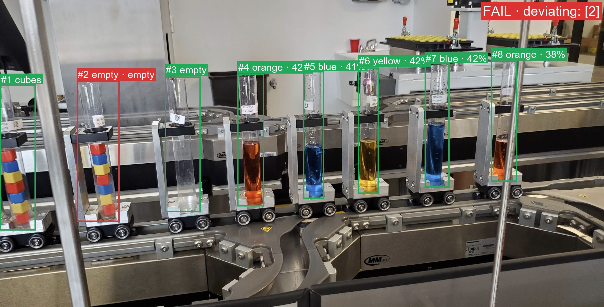

# Vial-line inspection web app

Local Gradio app around the fine-tuned Cosmos3-Nano LoRA. Upload a side-view photo of the filling line, paste
the manufacturing plan, and get:

- the model's JSON inspection report (per-vial content, fill %, status, deviating positions, pass/fail)
- a per-vial table
- the image annotated with one box per vial, green = OK, red = deviation, plus a PASS/FAIL banner



## Requirements

- The weights downloaded from the cluster (see `docs/12-inference-and-next-steps.md`):
  `models/Cosmos3-Nano-qwen3vl/` (17 GB base) and `models/adapter_epoch5/` (LoRA)
- A CUDA GPU with ≥ 20 GB (tested on RTX PRO 5000 24 GB), the repo venv with CUDA torch:

```powershell
.\.venv\Scripts\python.exe -m pip install --index-url https://download.pytorch.org/whl/cu130 torch torchvision
.\.venv\Scripts\python.exe -m pip install "transformers>=4.57" accelerate safetensors peft pillow gradio
```

## Run

```powershell
cd C:\Code\cosmos\cosmos3tao
.\.venv\Scripts\python.exe apps\inspection_app.py
```

The model loads once (~20 s), then the browser opens at http://127.0.0.1:7860. Options:

| flag | default | meaning |
| --- | --- | --- |
| `--model` | `models/Cosmos3-Nano-qwen3vl` | converted base checkpoint |
| `--adapter` | `models/adapter_epoch5` | LoRA adapter dir (omit / point to a missing dir to run the base model) |
| `--port` | 7860 | |
| `--share` | off | temporary public `gradio.live` link |
| `--device-map auto` | `cuda` | CPU offload for smaller GPUs (slow) |

## Using it

1. Drop an image (or click the `plant.jpg` example).
2. Edit the **Manufacturing plan** to what that run should contain, e.g.
   `position 1 (VIAL 0174): colored cubes; position 2: colored cubes; position 3: empty; position 4 (VIAL 0019): orange liquid; …`
3. Pick a question: full JSON report (default), deviating positions, vial count, or a free-form question.
4. **Inspect.** ~18 s for the report on a laptop GPU, plus ~20 s if bounding boxes are enabled.

Try changing the plan to something wrong (e.g. call position 5 "red liquid") to see the vial turn red and the
verdict flip to FAIL with `wrong_color`.

## How the boxes are produced

The LoRA adapter was trained to answer inspection questions, not to output coordinates. For boxes the app asks
the **base** Qwen3-VL model, which has native grounding: the LoRA deltas are subtracted from the weights for that
call and added back afterwards (`model_runtime.Runtime.set_adapter`), so one copy of the weights serves both
roles. The base model returns coordinates normalised to 0–1000, which are scaled to the image. Two prompt
phrasings are tried and the answer whose vial count matches the report is kept; boxes are ordered left→right and
paired with the report's positions. If grounding fails, evenly spaced placeholder boxes are drawn and flagged
"approximate".

Files: `inspection_app.py` (UI, drawing), `model_runtime.py` (model loading, adapter toggle, inference,
grounding). Example outputs: `example_plant_annotated.jpg`, `example_synthetic_annotated.jpg`.
