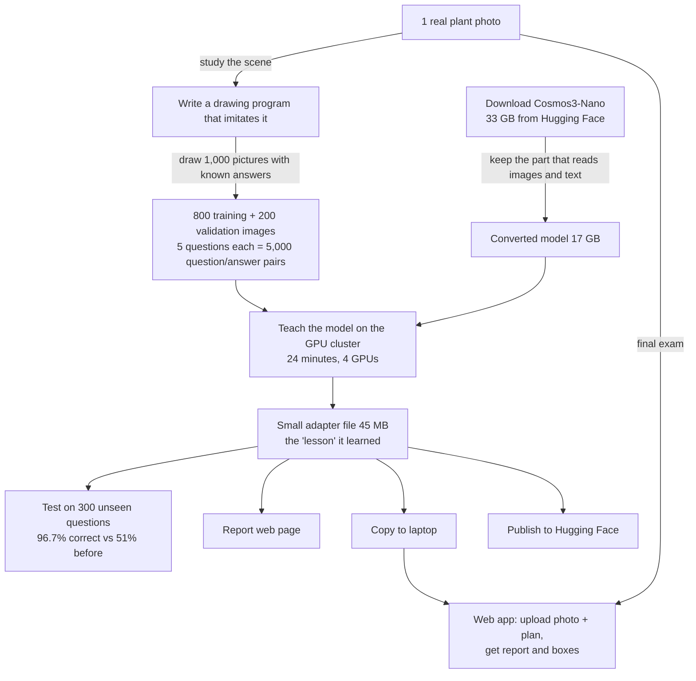

# 00 · The whole journey, start to finish (plain language)

*One photo + a drawing program + 24 minutes of training = a 45 MB expert you can run anywhere.* The whiteboard
above is the whole project on one page: a data track (one real photo → a drawing program → 1,000 pictures with
known answers), a model track (download Cosmos3-Nano → keep the part that reads images and text), 24 minutes of
training on 4 GPUs, and a 45 MB adapter that goes into a report, a laptop, a web app, and a Hugging Face repo.
Accuracy on 300 unseen questions rose from 51 % to 96.7 %. The sections below walk through each box in order.

This chapter tells the story of the project in order, without assuming you know machine learning or clusters.
Each step names the command from the main README that performs it and the chapter with the technical detail.

## The problem we set out to solve

A filling line moves small glass vials past a camera. Each vial should contain what the production plan says:
a certain colour of liquid filled to about a third, a stack of coloured cubes, or nothing. Today a person
looks at the line to catch mistakes: wrong colour, too little or too much liquid, an empty vial, the wrong kind of
content. We wanted a model that looks at one photo, reads the plan, and writes the inspection report itself.

We started with **one real photo** of the line (`data/real/plant.jpg`) and NVIDIA's **Cosmos3-Nano** model, an
AI that can look at pictures and answer questions in text, but that had never seen this line or this task.

## The journey in one picture

## Step by step

### 1. Look at the real photo and describe the scene

The photo shows a metal track with wheeled carriers, each holding one tall clear vial with a printed label.
Some vials hold coloured liquid filled to about one third, some hold a stack of red, blue and yellow cubes, some
are empty. There is no production plan visible in the picture, so the plan has to be given to the model as text.

### 2. Create training pictures (README step 4, `ptyche_setup.sh`)

You cannot teach a model from one photo. Instead we wrote a small program that **draws** pictures of the same
kind of scene, and because the program decides what goes into every vial, it also knows the correct answer for
every picture. Chapter 03 explains this in detail; the short version:

| | |
| --- | --- |
| Real photos used as a template | 1 |
| Drawn pictures | 1,000 (800 for training, 200 for checking during training) |
| Questions asked about each picture | 5 |
| Question/answer pairs the model learns from | 4,000 training, 1,000 validation |
| Pictures with a deliberate mistake in at least one vial | about 80 % (each vial has a 25 % chance of a defect) |

Every picture comes with the plan text ("position 1: orange liquid; position 2: cubes; …") and the true report.

### 3. Get the model and make it loadable (README steps 4–5)

Cosmos3-Nano is downloaded from Hugging Face (33 GB). It comes bundled with a second model that generates
video, which we do not need and which the training software cannot load. Chapter 05 describes how we extract
just the "look and read" part into a standard format (17 GB). Nothing is lost for our task.

### 4. Teach the model (README step 6, `sbatch … ptyche_train.sbatch`)

Training does not run on the laptop. We send a job to a GPU cluster where 4 large GPUs work together for about
24 minutes. The model is shown the 4,000 question/answer pairs five times over ("5 epochs"). We do not rewrite
the whole model; we train a thin **adapter** (a technique called LoRA) that nudges its attention. The adapter is
only 45 MB, while the model is 17 GB.

How we know it is learning: the "loss", a measure of how wrong its answers are, fell from 0.29 to 0.03 on the
training pictures, and from 0.097 to 0.035 on the 200 pictures it never trained on. Chapter 07 shows what the
job log looks like while this happens.

### 5. Check accuracy honestly (README step 10, `ptyche_eval.sbatch`)

Loss is a training-time number; what matters is whether the answers are right. We asked 300 questions on
validation pictures the model had never trained on and graded them, for both the original model and the trained
one (chapter 09):

| Question | Original model | After training |
| --- | --- | --- |
| What is in vial N? | 68 % | 100 % |
| How many vials? | 100 % | 100 % |
| Does vial N match the plan? | 77 % | 100 % |
| Which positions deviate from the plan? | 10 % | 88 % |
| Write the full inspection report | 0 % | 95 % |
| **All questions** | **51 %** | **96.7 %** |

The original model could see colours but did not know how to compare against a plan. Training taught it that.
The remaining mistakes are all of one kind: vials that are over-filled, mostly with clear liquid, which the model
sometimes calls normal. It never invented a defect that was not there, and its pass/fail verdict was right every
time.

### 6. Make a readable report (README step 9, `make_report.py`)

Everything above is turned into one web page (`report/run_lyris_gb200_3044273.html`): a summary in sentences,
headline numbers, the loss curves, the per-epoch table, accuracy bars for both models, and a gallery of the ten
pictures the trained model got wrong with an explanation for each. Chapter 10.

### 7. Bring it back to the laptop and use it (`inferencing/README.md`, `apps/`)

The 17 GB model and the 45 MB adapter are copied to the laptop. A small web app loads them once and then, for
any uploaded photo plus a plan, returns the report, a table, and the photo with a box drawn around each vial:
green if it matches the plan, red if not. On the original real photo it got 7 of 8 vials right on its first try;
the one it missed is half hidden behind a frame.

### 8. Share it (`cluster/hf_upload.sh`)

The adapter, the evaluation results and a model card can be published to a Hugging Face repository so others can
download and use them. The base weights inherit NVIDIA's model licence.

## What it cost

| | |
| --- | --- |
| GPU time for training | 24 minutes on 4 GPUs |
| GPU time for the accuracy test | about 10 minutes on 2 GPUs |
| Data collection | none, apart from the one reference photo |
| Trained artefact | 45 MB adapter |
| Laptop needed to run it | one GPU with 24 GB of memory |

## What to do next

The model has learned the task on drawn pictures. To trust it on the real line, collect a few dozen real photos
with their plans and the true contents, mix them into the training pictures, and repeat steps 4–6. The whole
loop takes under an hour of cluster time. Chapter 12 lists the specific changes for the over-fill weakness.
