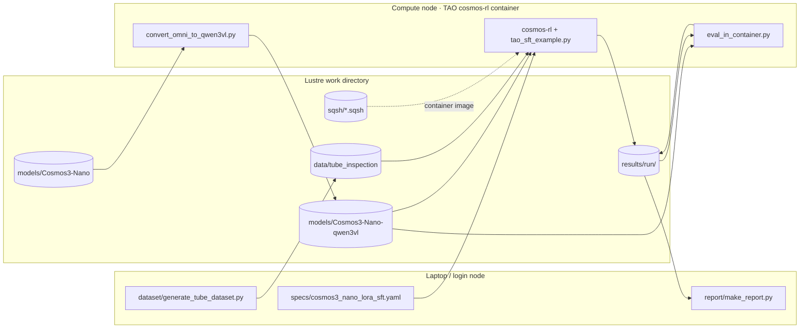

# 01 · Overview and architecture

## Goal

Teach **nvidia/Cosmos3-Nano** (an 8-billion-parameter vision-language "reasoner") to inspect a vial-filling
line: given one side-view image and a manufacturing plan written as text, report what each vial contains,
whether its fill level is right, which positions deviate from the plan, and an overall pass/fail.

We do this with **LoRA supervised fine-tuning** through **NVIDIA TAO**'s cosmos-rl backend, running as a SLURM
job on a GPU cluster. The laptop is only used for generating data, submitting jobs and reading results.

## The moving parts



| Layer | What it is | Where it lives |
| --- | --- | --- |
| **Synthetic data** | 800 train / 200 val PNGs of a vial track plus LLaVA-style `annotations.json` | `data/tube_inspection/{train,val}` on Lustre |
| **Base model** | `nvidia/Cosmos3-Nano` from Hugging Face (33 GB, Omni format) | `models/Cosmos3-Nano` |
| **Converted model** | Same weights re-keyed as a plain Qwen3-VL checkpoint (17 GB) | `models/Cosmos3-Nano-qwen3vl` |
| **Container** | `nvcr.io/nvidia/tao/tao-toolkit:7.0.1-cosmos-rl`, imported once to a squashfs file | `sqsh/…-aarch64.sqsh` |
| **Training spec** | YAML describing LoRA, optimizer, data paths, parallelism | `specs/` in the repo, rendered per run |
| **Trainer** | `cosmos-rl` (NVIDIA's RL/SFT framework) driven by TAO's dataset hook | inside the container |
| **Outputs** | checkpoints, safetensors LoRA export, `train.log`, best-score marker | `results/<run>/` |
| **Evaluation** | fine-tuned vs base accuracy on the val split | `results/<run>/eval_*` |
| **Report** | one self-contained HTML page | `report/*.html` |

## Why these choices

**Why TAO's cosmos-rl container instead of a hand-rolled training script?** TAO ships a tested recipe for
Cosmos Reason: the container has a pinned PyTorch, cosmos-rl, FSDP configuration, a LoRA implementation, a LLaVA
data loader (`/opt/cosmos_rl/tao_sft_example.py`) and checkpoint export. We only supply data and a spec. We call
the same command TAO's own FTMS service calls, which we verified by reading the TAO client source
(`nvidia_tao_core/api_utils/entrypoint_mimicker/vlm_entrypoint.py`):

```
cosmos-rl --config <spec.toml> /opt/cosmos_rl/tao_sft_example.py
```

**Why SLURM + Pyxis rather than Docker?** NVIDIA's clusters expose GPUs only through SLURM; Pyxis lets `srun`
start a process inside a container image transparently. The whole pipeline is therefore "a shell script that
calls `srun --container-image=…`".

**Why convert the model?** The Hugging Face repo is a single "Omni" checkpoint holding the 8B reasoner, an 8B
video generator, and action/audio heads under a custom `cosmos3_omni` architecture. The TAO 7.0.1 image's
Transformers does not know that architecture, but the reasoner inside it *is* a Qwen3-VL-8B. Chapter 05
explains the 1:1 re-keying.

**Why LoRA?** Low-Rank Adaptation trains small rank-16 matrices on the attention projections instead of the
full 8B weights. It needs far less memory, trains in 24 minutes on 4 GPUs, and produces a ~100 MB adapter.

**Why synthetic data?** We had one real plant photo. The generator produces unlimited labeled scenes in the
same style (wheeled carriers, labeled clear vials, liquids at one-third fill, cube stacks, empties) with exact
ground truth, so the model can learn the *task*; real frames can be mixed in later for domain transfer.

## The run that this documentation describes

| | |
| --- | --- |
| Cluster / partition | lyris `gb200`, 1 node × 4 GB200 GPUs (arm64 Grace CPUs) |
| Training | 5 epochs, 625 optimizer steps, batch 8 per replica, 24 minutes |
| Loss | train 0.290 → 0.033, validation 0.0971 → 0.0353 (improved every epoch) |
| Accuracy (300 held-out questions) | 96.7% fine-tuned vs 51.0% untuned base |
| Artifacts | `results/cosmos3_nano_tube_lora_3044273/`, report `report/run_lyris_gb200_3044273.html` |

## Reading order for the README steps

| README step | Chapter |
| --- | --- |
| 0–3 login, env vars, clone, enroot credentials | 02 |
| 4 `ptyche_setup.sh` | 03, 04 |
| 5 `ptyche_prepare_model.sh` | 05 |
| 6 `sbatch … ptyche_train.sbatch` | 06, 07 |
| 7–8 monitor, results | 08 |
| 9 report | 10 |
| 10 evaluation | 09 |
