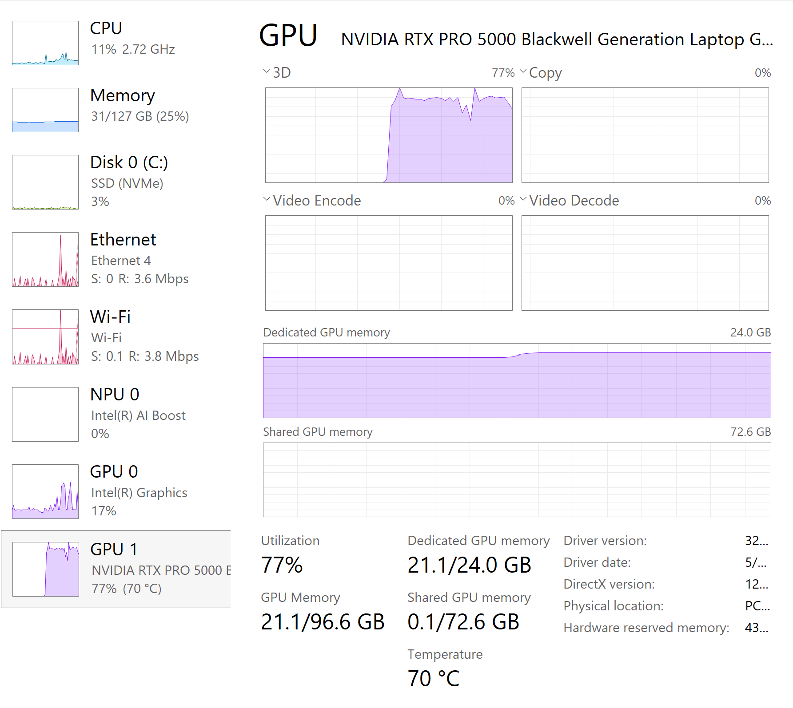
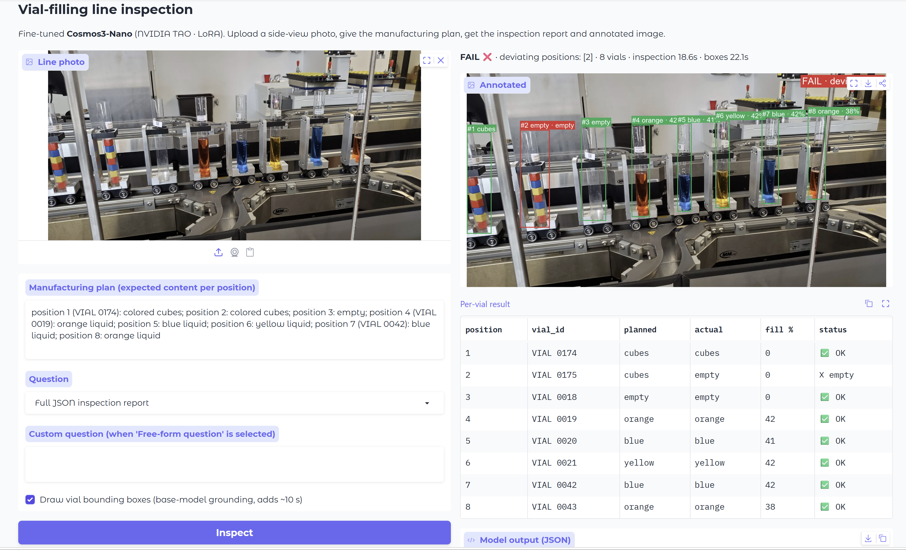

# Local inferencing with the fine-tuned Cosmos3-Nano

How to run the fine-tuned vial-inspection model on a laptop GPU, both through the web app and from the command
line, with what to expect on screen and on the GPU.

## What runs where

| piece | size | location |
| --- | --- | --- |
| Base model `Cosmos3-Nano-qwen3vl` (reasoner + vision tower, Qwen3-VL layout, bf16) | 17 GB | `models/Cosmos3-Nano-qwen3vl/` |
| LoRA adapter, epoch 5 (best validation loss 0.0353) | 45 MB | `models/adapter_epoch5/` |
| Web app | | `apps/inspection_app.py` + `apps/model_runtime.py` |
| Command-line runner | | `inspect/local_infer.py` |

Both weights come from the cluster; see `docs/12-inference-and-next-steps.md` for the `scp` commands. Nothing is
trained locally: the app merges the LoRA matrices into the base weights in memory at start-up.

## Hardware footprint



Task Manager during an inspection on an RTX PRO 5000 laptop GPU (24 GB):

- **Dedicated GPU memory 21.1 / 24.0 GB.** The bf16 weights take ~16.5 GB; the rest is the KV cache and image
  activations for one 2750 × 1402 photo. A 24 GB card is the practical minimum for full precision; below that use
  `--device-map auto` (CPU offload, slower).
- **Utilisation 77 %** while generating; idle between requests. The "3D" engine is the compute path.
- **System RAM 31 / 127 GB** — the weights are read from disk straight into GPU memory; RAM use stays flat.
- ~20 s to load the model, ~18 s for a JSON report (≈ 300 tokens), ~20 s more for bounding boxes.

## Setup (once)

```powershell
cd C:\Code\cosmos\cosmos3tao
.\.venv\Scripts\python.exe -m pip install --index-url https://download.pytorch.org/whl/cu130 torch torchvision
.\.venv\Scripts\python.exe -m pip install "transformers>=4.57" accelerate safetensors peft pillow gradio
```

The PyTorch index URL matters: the default PyPI wheel on Windows is CPU-only. Check:

```powershell
.\.venv\Scripts\python.exe -c "import torch;print(torch.__version__, torch.cuda.is_available(), torch.cuda.get_device_name(0))"
```

Expected: `2.14.0+cu130 True NVIDIA RTX PRO 5000 ...`.

## The web app

```powershell
.\.venv\Scripts\python.exe apps\inspection_app.py
```

The console prints `LoRA deltas prepared for 144 modules`, then the browser opens at http://127.0.0.1:7860.



### Walk-through of the screenshot

1. **Line photo** (top left): `data/real/plant.jpg` dropped into the upload box.
2. **Manufacturing plan** (left): the expected content per position, written as free text. Positions are
   counted left to right; vial IDs are optional. This is what the model compares the image against.
3. **Question**: *Full JSON inspection report* (default). Other choices: *List deviating positions*,
   *Count vials*, or *Free-form question* with your own text in the box below.
4. **Draw vial bounding boxes**: on. Adds one grounding call to the base model (~20 s).
5. **Inspect** runs the model. The right column fills in:
   - the verdict line: `FAIL ❌ · deviating positions: [2] · 8 vials · inspection 18.6s · boxes 22.1s`
   - **Annotated** image: one box per vial, green = matches the plan, red = deviation; label shows position,
     detected content and fill percentage; a PASS/FAIL banner top-right
   - **Per-vial result** table: position, vial ID, planned, actual, fill %, status
   - **Model output (JSON)**: the raw report, e.g.
     `{"vials":[{"position":1,"vial_id":"VIAL 0174","planned":"cubes","actual":"cubes","fill_pct":0,"status":"OK"}, …],"deviating_positions":[2],"pass":false}`

In this run the model read all liquids (orange, blue, yellow, blue, orange with 38–42 % fill), the empty vial
and the first cube stack correctly, and flagged position 2 as `empty` where the plan says cubes. That vial is
partly hidden behind the shield frame at the far left of the photo; it is the one known miss on this image and
the reason real plant frames should be added to the training data.

### Things to try

- Change the plan so it disagrees with the picture (call position 5 "red liquid"): vial 5 turns red with
  `wrong_color` and the verdict flips to FAIL.
- Switch the question to *Count vials* or ask a free-form question such as
  `Which vial has the lowest fill level?`
- Untick the boxes option for a faster ~18 s round trip.
- Upload a synthetic validation image from `data/tube_inspection/val/images/` and paste its plan from
  `ground_truth.json` to see near-perfect boxes and a clean report.

### Command-line flags

| flag | default | purpose |
| --- | --- | --- |
| `--model` | `models/Cosmos3-Nano-qwen3vl` | base checkpoint |
| `--adapter` | `models/adapter_epoch5` | LoRA dir; point at a non-existent dir to run the plain base model |
| `--port` | 7860 | |
| `--share` | off | temporary public gradio.live link |
| `--device-map auto` | `cuda` | offload layers to CPU when GPU memory is short |

Stop the app with Ctrl-C in the console.

## Command line instead of the app

```powershell
.\.venv\Scripts\python.exe inspect\local_infer.py --image data\real\plant.jpg --plan "position 1 (VIAL 0174): colored cubes; position 2: colored cubes; position 3: empty; position 4 (VIAL 0019): orange liquid; position 5: blue liquid; position 6: yellow liquid; position 7 (VIAL 0042): blue liquid; position 8: orange liquid"
```

Prints the JSON report. Useful variants: `--ground-truth data\tube_inspection\val\ground_truth.json` (plan
lookup and automatic check for synthetic images), `--no-adapter` (base model), `--question "..."`,
`--merge-out models\Cosmos3-Nano-tube-merged` (write a standalone merged checkpoint for serving).

## How the boxes are made

The adapter was trained to answer inspection questions, not to output coordinates. For the boxes the app asks
the **base** model, whose Qwen3-VL heritage includes native object grounding: the LoRA deltas are subtracted from
the weights for that call and added back afterwards, so one copy of the model serves both jobs. The base model
returns coordinates normalised to 0–1000; the app scales them to the image, orders vials left to right and pairs
them with the report positions. Two prompt phrasings are tried and the one whose vial count matches the report is
kept. If grounding fails the app draws evenly spaced placeholder boxes and labels them "approximate".

## Prompt contract

Keep the exact structure the model was trained on (the app builds it for you):

```
<role text: quality inspector, side view, vials numbered left to right, one-third fill is normal>
Manufacturing plan: position 1 (VIAL 0007): colored cubes; position 2 (...): ...
<question>
```

Vocabulary: contents `orange, blue, yellow, red, green, purple, clear, cubes, empty`; statuses
`OK, wrong_color, underfill, overfill, empty, wrong_content`.

## Troubleshooting

| symptom | fix |
| --- | --- |
| `Torch not compiled with CUDA enabled` / `cuda False` | reinstall torch from the `cu130` index URL above |
| `Qwen3VLVideoProcessor requires the Torchvision library` | `pip install --index-url https://download.pytorch.org/whl/cu130 torchvision` |
| `CUDA out of memory` | close other GPU apps; run with `--device-map auto`; or lower the image size |
| Boxes misaligned by one | a partial vial at the image edge; crop the photo so only planned vials are visible |
| Very long first load | 17 GB read from disk; keep `models/` on the NVMe drive |
